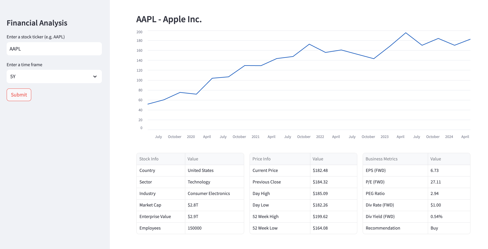

# streamlit-yfinance
A sample [Streamlit](https://streamlit.io/) web application for retrieving a stock quote using YFinance API.

For a step-by-step guide to deploying on Streamlit, see [this](https://alphasec.io/build-an-interactive-python-web-app-with-streamlit/) post. To deploy on [Railway](https://railway.app/?referralCode=alphasec), click the button below.

